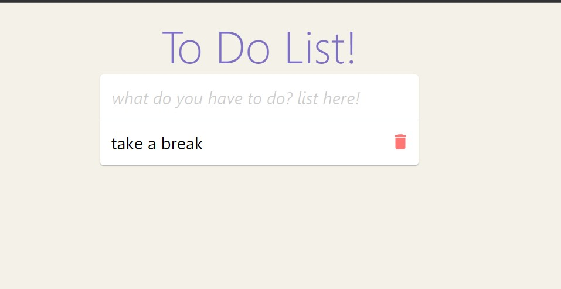
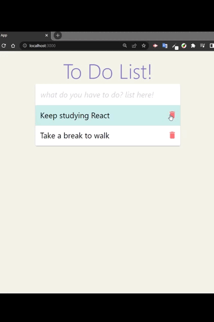

<div align="center">


</div>
<div align="center">
<h1>To-Do List com React e Hooks</h1>


<!-- BADGES W/ LINK (see https://shields.io/)-->
 &nbsp; 
</div>

<!-- DESCRIPTION -->

<p>
Este é um projeto de lista de tarefas simples construído com React utilizando o useState para gerenciar o estado da lista de tarefas, PropTypes para validar as propriedades dos componentes e LocalStorage para salvar as tarefas na memória do navegador.
</p>


<!-- PREVIEW -->
##  Funcionalidades
<ul>
<li> Adicione uma nova tarefa pressionando o 'ENTER' </li>
<li> Pressione "ESC" para apagar a palavra escrita no "input" </li>
<li> Marque uma tarefa como concluída </li>
<li> Exclua uma tarefa </li>
</ul>

##  Tecnologias utilizadas
<ul>
<li> React </li>
<li> HTML </li>
<li> CSS </li>
<li> LocalStorage </li>
</ul>


## 🖼️ Project
<div align="center" width="100%">

</div>

<!-- INSTALLATION AND USAGE -->


## ⚙️ Como executar o projeto


You need [node](https://nodejs.org/en/download/) to run this project. This example was created using version `v16.15.1`.

Clone o repositório em sua máquina local
 
```bash
git@github.com:deborahcristinadeoliveira/toDo_List.git
```

Instale as dependências do projeto executando o comando:

```bash
npm install
```

Instale as dependências do React-Icons:

```bash
npm install react-icons --save
```

Para visualizar a executando o comando:

```bash
npm start
```

<!-- CONTACT -->

## ✉️ Contact

[](https://github.com/deborahcristinadeoliveira/) 
[](https://www.linkedin.com/in/deborah-cristina-desenvolvedoraweb/)

